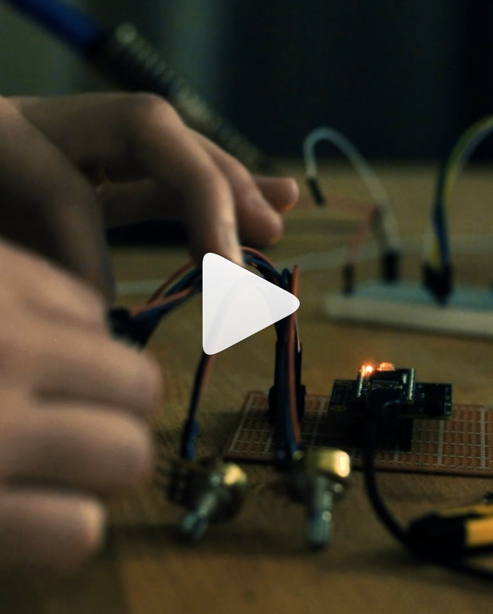

# SimpleSynth
SimpleSynth is a Teensy based synth with the main objective to keep it simple.

NOTE: I have stopped maintaining this repo in favor of [Synth](https://github.com/ghostintranslation/synth).

## Features

* FM, AM and Ring synthesis with 1 carier and 1 modulator
* Polyphonic synth, Arpeggiator and Drone modes
* Controllable modulator gain and frequency
* Controllable Attack, Decay, Release
* MIDI over USB
* MIDI through the Hobbytronics USB Host Board Controller
* Audio jack output
* Audio over USB


## Compatibility
* It has only been tested on Teensy 3.2 with its audio board.
* Compatible with any midi instrument/DAW sending midi notes messages
* Also compatible with Novation Launchpad S specifically (lights turning on)

## Getting Started

These instructions will get you a working copy of the SimpleSynth.

### Prerequisites

What things you need to make it work:

```
Teensy 3.2
Teensy audio board
9 potentiometers
```

### Installing

First download or clone this repository and open it in Arduino.

Basically you just need to connect 9 potentiometers to the 0 to 8th analog Teensy's pins. If you'd like you can change the pin numbers just at the init in the main file `Synth synth(0,1,2,3,4,5,6,7,8)`

Here is a simple schema showing how to connect potentiometers, just in case:


You will have to set the USB type. Go in `Tools > USB Type > Serial + MIDI + Audio`

Now you are all set, just upload the code to the Teensy and play with it!

## How to use

Here is a description of the 9 inputs and what they do:

```
1. Synth
    1. FM
    2. FMx10
    3. Ring
    4. AM
    5. AMx10
2. Mode
    1. Synth
    2. Arp
    3. Drone
3. Parameter
    1. Synth: Glide          (TODO)
    2. Arp: Time             (1 to 500ms) 
     . Arp with Midi clock   (TODO)
    3. Drone: Free frequency (0 to 1023Hz)
4. Modulator Frequency
    1. FM / AM               (1Hz - 50Hz)
    2. FMx10 / AMx10 / Ring  (1Hz - 500Hz)
5. Modulator Level           (0 to 100%)
6. Sin/Saw Mix               (TODO)
7. Attack                    (0 to 2000ms)
8. Decay                     (0 to 2000ms)
9. Release                   (0 to 2000ms)

```

## FM, AM and Ring

SimpleSynth offers 3 types of synthesis:
* **Frequency Modulation**: the frequency is modulated. When done slow it can sound like a siren or a distorded tape. When done fast it can sound like bells.
* **Amplitude Modulation**: the amplitude is modulated. When done slow it sounds like a tremolo. When done fast... well it sounds differently.
* **Ring Modulation**: Similar to AM but instead of modulating the amplitude between 1 and 0, it is modulated between 1 and -1, thus the signal gets also inverted. It sounds like a different type of bells :)

### Audio design tool

Here is the schema from the audio design tool used in each voice:


https://www.pjrc.com/teensy/gui/

This could be optimized. For example, instead of using 5 oscillators (2 for FM, 2 for AM/Ring, and 1 to modulate) it could be 3: 1 sine, 1 sawtooth, 1 modulator. With that we could even use FM and AM/Ring together.

This is a priority TODO because the synth reaches the limit of Teensy 3.2 as to be a good polyphonic synth it requires at least 8 voices, so 8*5 oscillators = 40 oscilators and that seems to be too much for this chip.

## In action
Click on the images to watch the videos:

[](https://www.instagram.com/p/B3dC9hZhGUw/)

[](https://www.instagram.com/p/B4Qp4yuheBy/)

[](https://www.instagram.com/p/B4jEFymh2dZ/)


## About me
You can find me on Bandcamp and Instagram:

https://ghostintranslation.bandcamp.com/

https://www.instagram.com/ghostintranslation/


## License

This project is licensed under the MIT License - see the [LICENSE.md](LICENSE.md) file for details